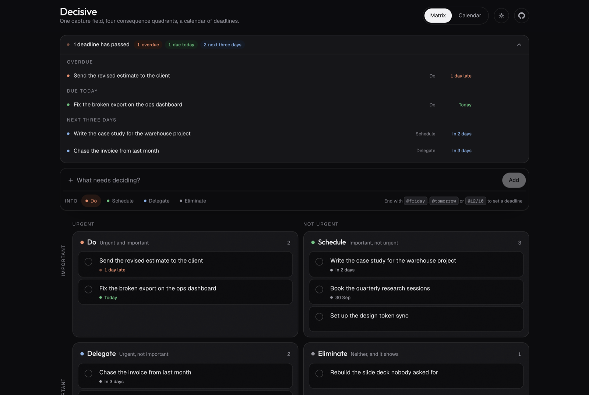
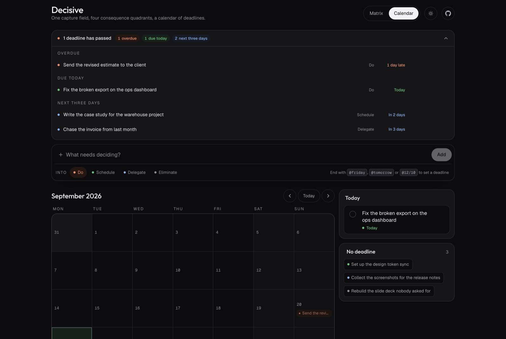
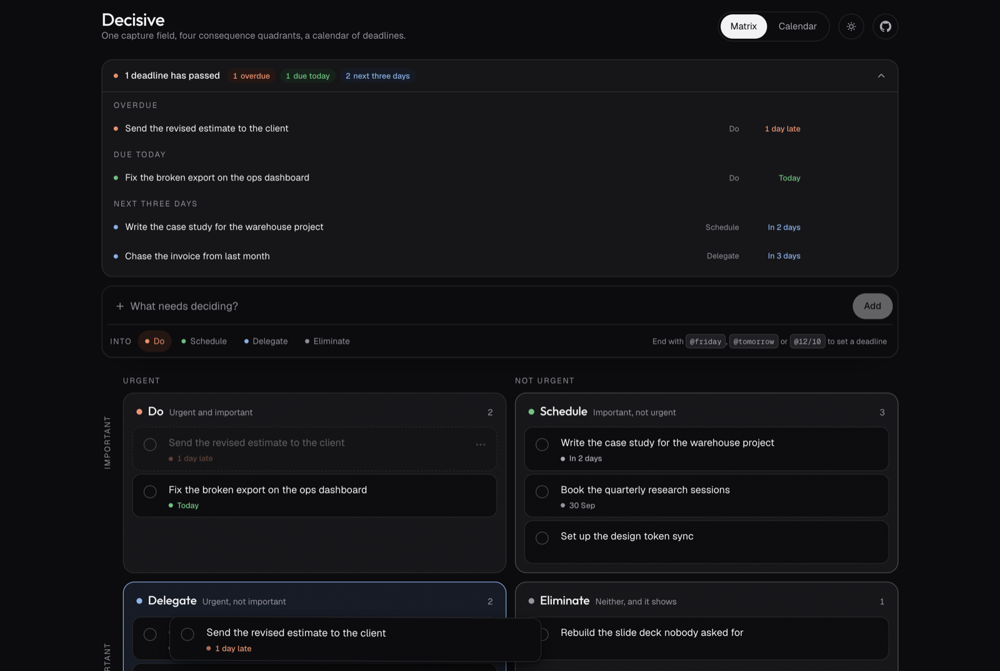
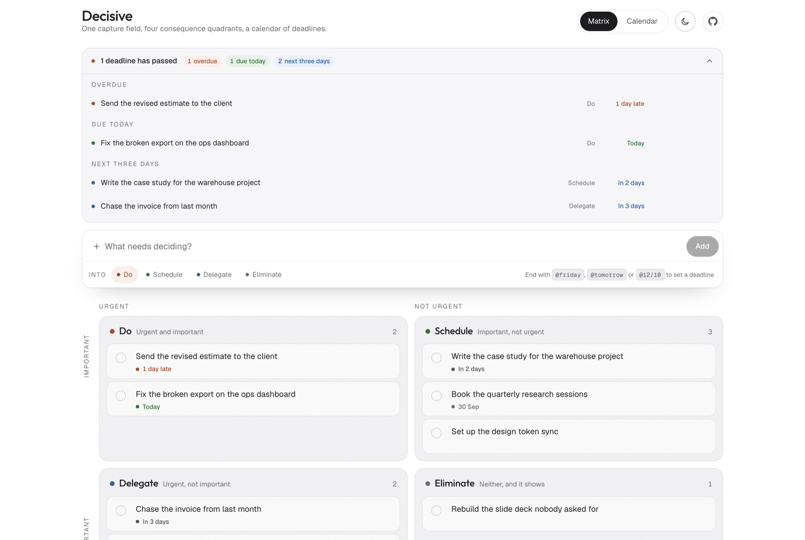
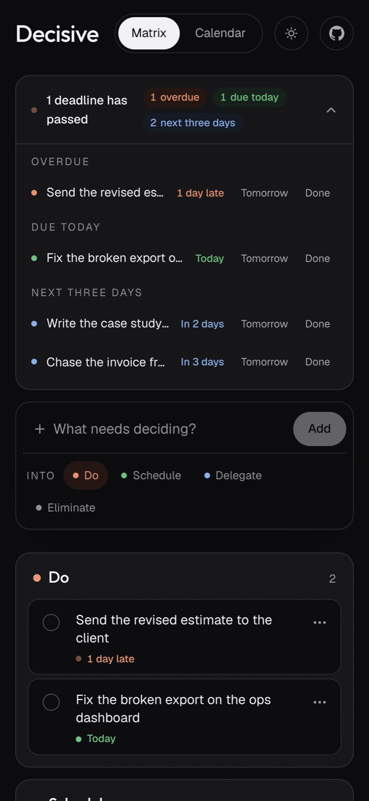

<h1 align="center">Decisive</h1>

<p align="center">
  <strong>A local first decision matrix, with the deadlines the matrix cannot hold.</strong>
</p>

<p align="center">
  One capture field · four consequence quadrants · a calendar of every deadline · a notification bar that tells you what is already late.
</p>

<p align="center">
  <a href="#run-it">Run it</a> ·
  <a href="#self-host-it">Self host it</a> ·
  <a href="#capture-syntax">Capture syntax</a> ·
  <a href="#keyboard">Keyboard</a> ·
  <a href="#your-data">Your data</a>
</p>

<p align="center">
  
  
  
</p>

<br>



<br>

## Why I built this

The Eisenhower matrix sorts work by consequence: urgent against important. It is
very good at telling you what a task is worth, and completely silent about when
it lands.

That silence is the gap. "Important, not urgent" is a category, not a date, and
a quadrant quietly filling up with them hides the week they all come due in. I
kept the method and added the two things it cannot hold on its own.

**A calendar of every deadline on the board.** Drag a task onto a day and that
is its deadline. Drag it to another day and it moves. Same gesture as moving a
card between quadrants, so there is one thing to learn and two places it works.



**A notification bar that reads the board live.** Overdue, due today, and the
next three days, at the top of the page where a deadline can still change what
you do next. It is not a feed and it does not accumulate: it is derived from the
same tasks everything else renders, so it can never disagree with them. Nothing
in it can be dismissed either, because a dismissed deadline is still a deadline.
What it offers instead is the two actions that actually resolve one: finish it,
or move it.

<br>

## How it feels

Dragging is not the HTML5 drag and drop API. That gives you a ghost you cannot
style, no position updates between events, no velocity, and nothing you can
interrupt: the card detaches from your pointer the moment you start moving it.
On a board whose entire purpose is moving things around, that is the product.

So the card stays glued to the pointer from the exact point you grabbed it,
leans the way you are throwing it, and springs back home if you let go over
nothing. Every quadrant that can receive it says so while it is in the air.



And none of it is the only way to do anything. Every task row carries a menu
that moves it between quadrants and sets its deadline, reachable by keyboard,
with arrow keys and Escape doing what you expect. A feature that only works by
dragging is not finished.

<br>

<table>
<tr>
<td width="55%" valign="top">

### Light and dark, both designed

Not an inversion. The dark palette is picked against `#0c0c0e` with body text
clearing 4.5:1 and secondary text clearing 3:1 in both themes.

The board opens dark every time, and the toggle lasts the visit.

</td>
<td width="45%">



</td>
</tr>
</table>

<table>
<tr>
<td width="40%">



</td>
<td width="60%" valign="top">

### It works on a phone

Row actions do not hide behind hover, because hover does not exist on a touch
screen. Tap targets are 36 to 44px. Nothing scrolls sideways.

The matrix stacks, the calendar keeps its six week grid so the page never
changes height as you page through months.

</td>
</tr>
</table>

<br>

## Capture syntax

Everything enters the board through one field. It defaults to **Do**, because
the cost of sorting a task later is near zero and the cost of stopping to
choose a quadrant while you are still holding the thought is not.

The deadline travels inside the text as a trailing `@token`, which is lifted
out of the title as you type:

| You type | The deadline becomes |
| --- | --- |
| `Send the estimate @today` | today |
| `Call the supplier @tomorrow` | tomorrow |
| `Draft the brief @friday` | the next Friday, today included |
| `Review the numbers @3d` | in three days |
| `Plan the quarter @2w` | in two weeks |
| `Ship the update @12/10` | 12 October, day first |
| `File the taxes @2026-10-12` | 12 October 2026 |

Anything it does not recognise is left in the title untouched, so typing an
email address never eats half your sentence.

<br>

## Keyboard

| Key | What it does |
| --- | --- |
| `C` | Jump to the capture field |
| `Enter` | Add the task |
| `V` | Switch between matrix and calendar |
| `Z` | Undo the last change |
| `Esc` | Cancel a drag, an edit or a menu |

Nothing asks whether you are sure. A delete that asks costs everyone a click to
protect the one case in fifty; undo costs nothing until you need it, and what
comes back is the whole previous board rather than just the row.

<br>

## Run it

```bash
git clone https://github.com/JulianGiraldo96/decisive.git
cd decisive
npm install
npm run dev
```

Open http://localhost:3000. There is no database to start, no environment file
to fill in and no service to sign up for.

<br>

## Self host it

The app is a static front end with a tiny Next.js server in front of it. It
holds no data, so there is no volume to mount and nothing to back up on the
server side.

### Docker

```bash
docker compose up -d
```

Or without compose:

```bash
docker build -t decisive .
docker run -d --name decisive -p 3000:3000 --restart unless-stopped decisive
```

The image is multi stage and runs as a non root user. Nothing in it is
writable and it carries no package manager, no source and no build cache.

### Behind a reverse proxy

It is a plain HTTP server on port 3000 with no websockets and no long lived
connections, so any proxy will do. Caddy, for example:

```
decisive.example.com {
  reverse_proxy localhost:3000
}
```

### Node, without Docker

```bash
npm ci
npm run build
npm start
```

Runs on port 3000, or set `PORT`. Use whatever keeps it up: systemd, pm2, a
`screen` session you are not proud of.

The build also emits a standalone server at `.next/standalone/server.js`, which
is what the Docker image runs. If you want to use it directly, it needs the
static assets beside it, the same three copies the Dockerfile makes:

```bash
cp -r public .next/standalone/public
cp -r .next/static .next/standalone/.next/static
node .next/standalone/server.js
```

### One click

[](https://vercel.com/new/clone?repository-url=https://github.com/JulianGiraldo96/decisive)

<br>

## Your data

Tasks are written to your browser's `localStorage` under `decisive.tasks.v1`.

- No account, no server, no sync, no analytics, no telemetry, no network call
  on any path that matters.
- Nothing leaves the machine it was typed on, including when you self host it:
  the server never sees a task.
- Clearing your browser data clears the board. The board on your laptop is not
  the board on your phone.

That is the trade, and it is deliberate. If you want the same board in two
places, this is the wrong tool and I would rather say so here than bolt an
account onto it.

<br>

## Built with

Next.js 16, React 19, TypeScript, Tailwind v4 and Motion. No UI library, no
state library, no backend.

A few decisions worth naming, since they are the reason it feels the way it
does:

- **The entrance is a CSS keyframe, not JavaScript.** The board is the largest
  thing on the page and it paints on first render. Gating that behind a JS
  animation adds the whole hydration cost to the reported load time.
- **Springs where you can touch it, curves where you cannot.** A fixed duration
  animation cannot respond to new input. Anything the pointer drives settles on
  a spring instead.
- **Only `transform` and `opacity` animate.** Never `filter`, never `width`.
- **All three motion preferences are honoured**, not just the famous one:
  `prefers-reduced-motion`, `prefers-reduced-transparency` and
  `prefers-contrast` each have their own handling.
- **Tracking is size specific.** Large type gets negative letter spacing, body
  text sits near zero. One value for every size is wrong somewhere.

<br>

## Contributing

Issues and pull requests are welcome. [CONTRIBUTING.md](CONTRIBUTING.md) covers
the layout of the code and the handful of rules a change has to hold to.

<br>

## Credit

The four quadrant framing and the local first constraint come from
[Decisive by Derin Barutcu](https://github.com/derinbarutcu17/decisive), which
is where I first saw the idea done well. This is an independent rebuild in a
different stack, with the deadline calendar and the notification bar added, and
it is not affiliated with that project.

## License

MIT. See [LICENSE](LICENSE).
